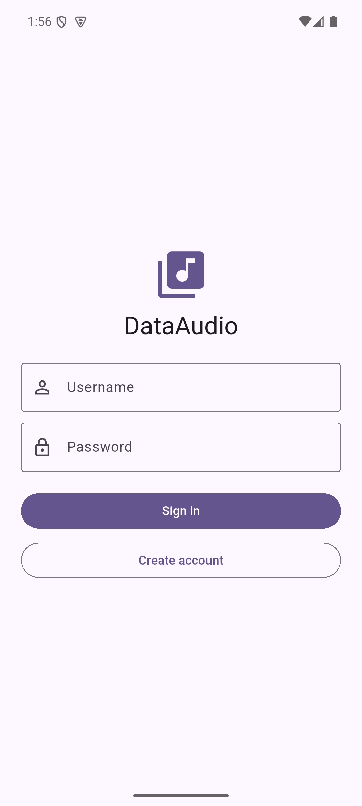
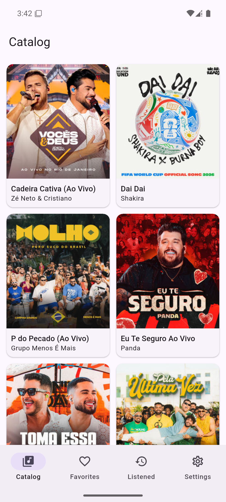
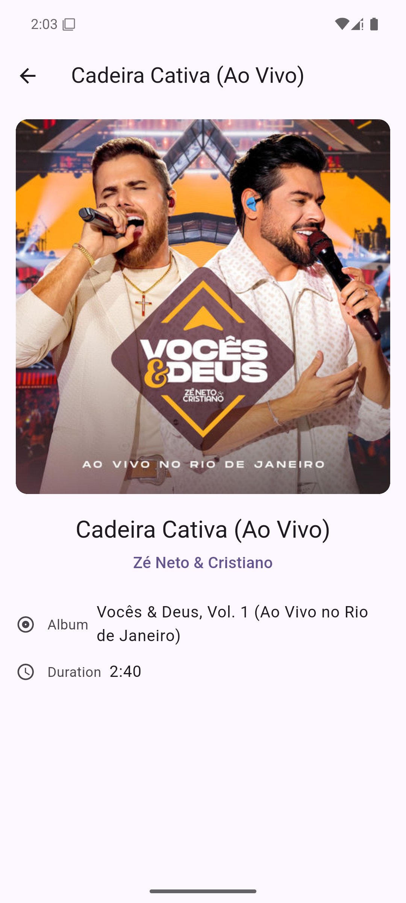
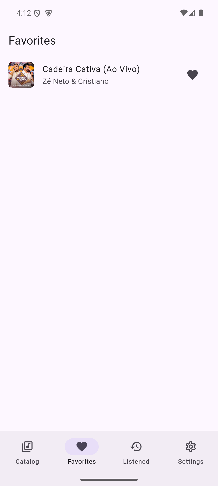
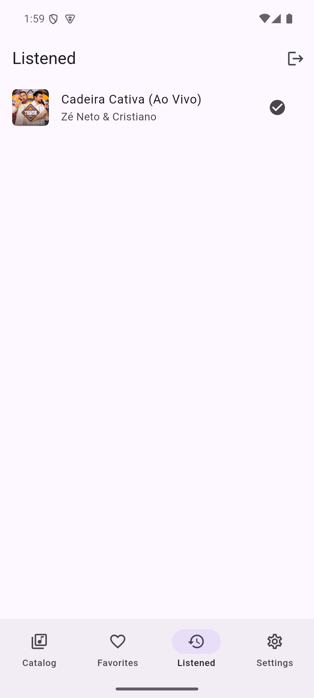

# DataAudio

**Catálogo interativo de músicas** construído em Flutter, consumindo a API pública da [Deezer](https://developers.deezer.com/api).
Navegue por faixas populares, busque músicas, veja detalhes, marque **Favoritos** e **Ouvidas** — com tudo preservado entre sessões.

> Projeto Somativo da disciplina **Desenvolvimento Mobile Híbrido** (BSI) — Prof. Mark Joselli.

[](https://github.com/rdsalvesPUC/dataaudio/actions/workflows/ci.yml)

---

## Índice

- [Funcionalidades](#funcionalidades)
- [Screenshots](#screenshots)
- [Stack](#stack)
- [Arquitetura](#arquitetura)
- [Estrutura de pastas](#estrutura-de-pastas)
- [Como executar](#como-executar)
- [Testes](#testes)
- [Requisitos funcionais (RF01–RF10)](#requisitos-funcionais-rf01rf10)
- [Documentação](#documentação)
- [Equipe](#equipe)

## Funcionalidades

- **Catálogo paginado** — faixas em `GridView`, com botão "Carregar Mais" que estende a lista.
- **Busca** — encontre uma faixa e vá direto aos detalhes.
- **Detalhes da faixa** — capa ampliada, artista, álbum e duração.
- **Favoritos** — marque e desmarque; a lista se atualiza reativamente.
- **Ouvidas** — histórico próprio do que você já escutou.
- **Login** — acesso ao catálogo apenas com sessão ativa.
- **Persistência** — suas listas sobrevivem ao fechamento do app.
- **Tema claro/escuro** — segue o sistema ou sua escolha.
- **Multi-idioma** — Português (BR) e Inglês, seguindo o sistema ou sua escolha.
- **Acessibilidade** — rótulos semânticos, contraste adequado e layout que respeita o aumento de fonte do sistema.

## Screenshots

| Login (RF07) | Catálogo (RF01) | Detalhes (RF02/RF03) |
|:---:|:---:|:---:|
|  |  |  |
| **Favoritos (RF04/RF05)** | **Ouvidas (RF07)** | |
|  |  | |

<!-- Adicionar conforme implementada: ajustes (tema/idioma) -->
_Tela de Ajustes (tema/idioma) em breve._

## Stack

| Camada | Tecnologia |
|---|---|
| Framework | Flutter (Dart), Material 3 + widgets adaptive |
| API | Deezer (endpoints públicos, sem autenticação) |
| Estado | [`provider`](https://pub.dev/packages/provider) |
| HTTP | [`http`](https://pub.dev/packages/http) |
| Persistência local | [`shared_preferences`](https://pub.dev/packages/shared_preferences) |
| Nuvem (bônus) | Firebase — Cloud Firestore + Firebase Auth |
| i18n | `flutter_localizations` + `intl` (ARB) |
| Testes | `flutter_test`, `mocktail`, `integration_test`, golden tests |

## Arquitetura

Arquitetura **em camadas** com **repository pattern**, no enquadramento **MVVM** — os Providers atuam como ViewModels das views.

```
views (telas)  →  providers (estado/ViewModel)  →  repositories (interfaces)  →  services (Deezer, storage, Firebase)
```

O princípio central: **views e providers nunca falam diretamente com a Deezer, o `shared_preferences` ou o Firebase** — apenas com interfaces de repositório. As implementações concretas são escolhidas num único ponto (o *composition root*), o que permite alternar entre persistência local e em nuvem sem alterar uma linha das telas.

> **Nota sobre nomenclatura:** a pasta `views/` contém as **telas** do app (o que a rubrica chama de _screens_). O nome segue o vocabulário MVVM adotado no projeto — cada view tem um Provider como ViewModel. Ver [ADR-0006](docs/adr/0006-camadas-repository-views-mvvm.md).

Todas as decisões de arquitetura estão registradas em [ADRs](docs/adr/README.md).

## Estrutura de pastas

```
lib/
├── core/          # tema, i18n, navegação, erros, injeção de dependência
├── models/        # Track, Artist, Album, AppUser
├── services/      # DeezerService, LocalStorageService, Firebase*
├── repositories/  # interfaces + implementações (local e nuvem)
├── providers/     # Auth, Catalog, Favorites, Listened, Settings
├── views/         # telas do app
├── widgets/       # componentes reutilizáveis
└── l10n/          # arquivos de tradução (ARB)

test/              # espelha lib/ — unit, widget e goldens
integration_test/  # testes ponta-a-ponta
docs/              # PRD, SDD, ADRs e Plano de Testes
```

## Como executar

**Pré-requisitos:** Flutter SDK (canal estável) e um emulador Android ou dispositivo físico.

```bash
# 1. Clonar o repositório
git clone https://github.com/rdsalvesPUC/dataaudio.git
cd dataaudio

# 2. Instalar as dependências
flutter pub get

# 3. Verificar o ambiente
flutter doctor

# 4. Executar
flutter run
```

Não é necessária nenhuma chave de API: os endpoints da Deezer usados aqui são públicos.

<details>
<summary><strong>Configuração opcional do Firebase (bônus)</strong></summary>

Os recursos de nuvem (sincronização e autenticação real) exigem um projeto Firebase próprio:

```bash
dart pub global activate flutterfire_cli
flutterfire configure
```

Isso gera o `lib/firebase_options.dart` — que **não** é versionado. O app funciona integralmente sem esta etapa, usando a persistência local.
</details>

## Testes

```bash
flutter test                              # unit + widget
flutter test --coverage                   # com relatório de cobertura
flutter test integration_test             # ponta-a-ponta (requer emulador)
flutter test --update-goldens             # regenerar referências visuais
```

Meta de cobertura: **≥ 80%** nas camadas de lógica. A estratégia completa está no [Plano de Testes](docs/04-Plano-de-Testes.md).

## Requisitos funcionais (RF01–RF10)

| RF | Requisito | Status | Arquivo principal |
|---|---|---|---|
| RF01 | Catálogo e paginação | ✅ | `lib/views/catalog/catalog_view.dart` |
| RF02 | Navegação para detalhes | ✅ | `lib/core/navigation/app_routes.dart` |
| RF03 | Tela de detalhes | ✅ | `lib/views/detail/track_detail_view.dart` |
| RF04 | Favoritos com Provider | ✅ | `lib/providers/favorites_provider.dart` |
| RF05 | Tela de favoritos | ✅ | `lib/views/favorites/favorites_view.dart` |
| RF06 | Persistência de dados | ✅ | `lib/repositories/local_favorites_repository.dart` + `local_listened_repository.dart` |
| RF07 | Login e itens ouvidos | ✅ | `lib/providers/auth_provider.dart` |
| RF08 | Busca | 🟨 | `lib/services/deezer_service.dart` (serviço pronto; falta a tela) |
| RF09 | Feedback de UI | 🟨 | `lib/widgets/error_view.dart` (aplicado no catálogo) |
| RF10 | Acessibilidade | 🟨 | `lib/widgets/app_network_image.dart` (Semantics + adaptive + tema) |

_Legenda: ⬜ pendente · 🟨 parcial · ✅ implementado. Atualizar conforme a implementação avança._

**Fundação (PF01 tema / PF02 i18n):** infraestrutura embutida desde o início — temas Material 3 claro/escuro ([`app_theme.dart`](lib/core/theme/app_theme.dart)) e traduções PT-BR/EN gerando `AppLocalizations` ([`lib/l10n/`](lib/l10n/)). As telas de ajuste manual entram com o `SettingsProvider`.

### Status geral

- ✅ Ambiente e toolchain (Flutter 3.47.2, JDK 17, Android SDK 36, AVD) e scaffolding em camadas (SDD §4).
- ✅ CI (`analyze` + `test --coverage`) em GitHub Actions.
- ✅ **75 testes** verdes; `flutter analyze` sem issues.

## Documentação

| Documento | Conteúdo |
|---|---|
| [PRD](docs/01-PRD.md) | Requisitos de produto, critérios de aceite, escopo |
| [SDD](docs/02-SDD.md) | Design de software, camadas, modelo de dados, diagramas |
| [ADRs](docs/adr/README.md) | Registros de decisão de arquitetura (14 decisões) |
| [Plano de Testes](docs/04-Plano-de-Testes.md) | Pirâmide de testes, cobertura, fluxo TDD e CI |

## Equipe

<!-- Preencher com o nome completo de TODOS os integrantes -->
- _A definir_

---

Projeto acadêmico, sem fins comerciais. Os dados de música são fornecidos pela API da Deezer e pertencem aos seus respectivos detentores de direitos.
