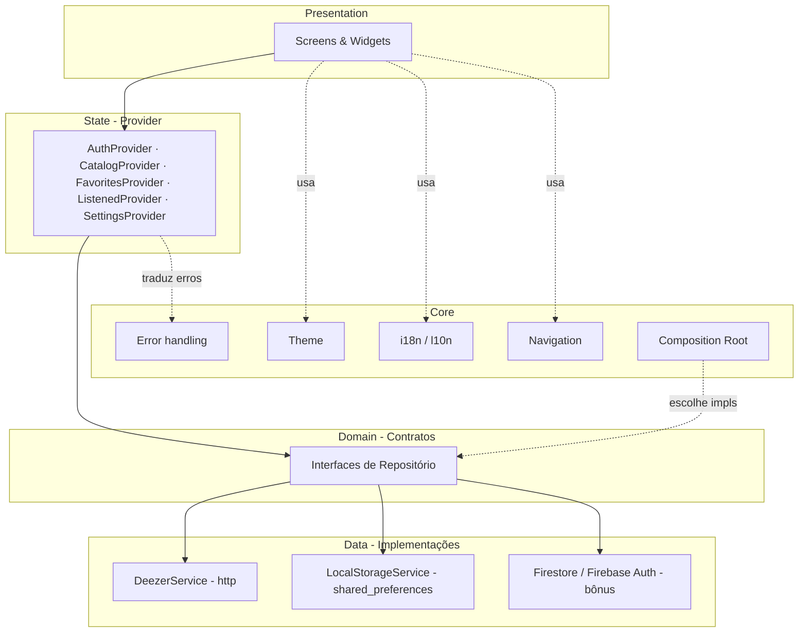
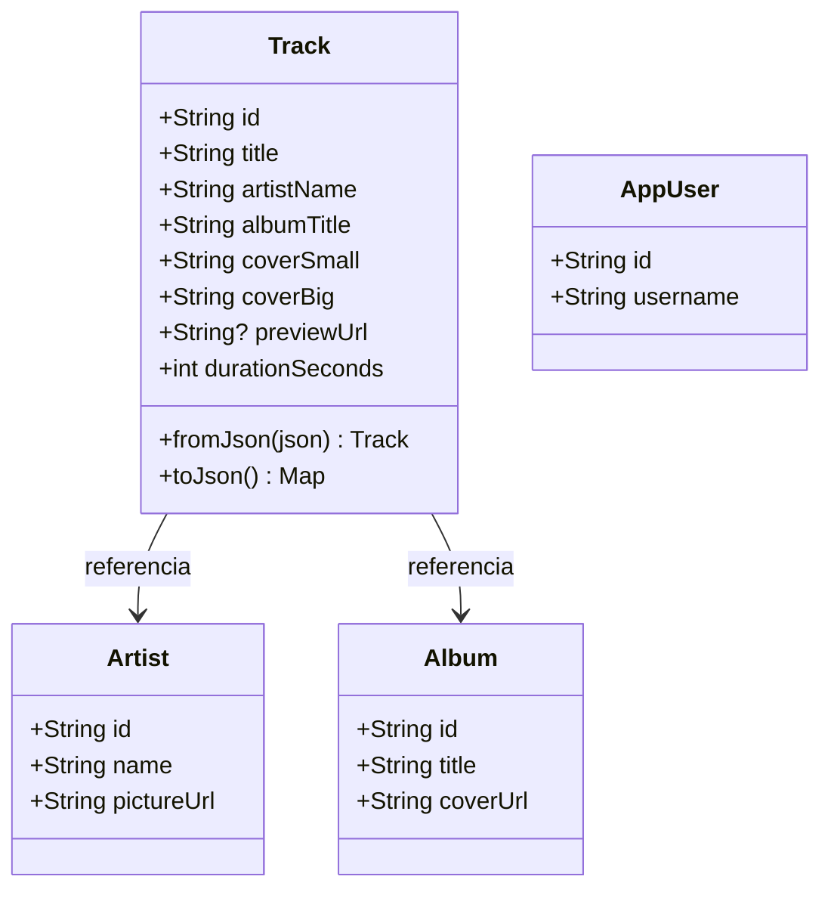
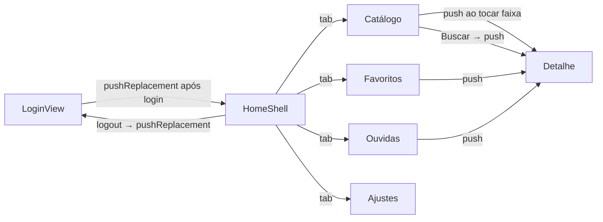

# SDD — Documento de Design de Software

**Projeto:** DataAudio — Catálogo Interativo de Músicas
**Versão do documento:** 1.1
**Status:** Em revisão
**Referência:** `01-PRD.md` (v1.1)

> **Changelog:** v1.1 — pasta `screens/` renomeada para `views/` (enquadramento MVVM, Providers como ViewModels); design system definido como Material 3 + widgets adaptive.

---

## 1. Propósito e escopo

Este documento descreve **como** o DataAudio será construído: a arquitetura em camadas, a estrutura de pastas, o modelo de dados (local e nuvem), os contratos entre camadas, o fluxo de navegação, o tratamento de erros e como tema/i18n se encaixam. Ele traduz o "o quê" do PRD em decisões estruturais. As justificativas comparativas ("por que Provider e não X") ficam nos **ADRs**; as metas e técnicas de teste, no **Plano de Testes**.

## 2. Princípios de design

1. **Dependa de abstrações, não de implementações.** Telas e Providers dependem de *interfaces* de repositório. Deezer, `shared_preferences` e Firebase são detalhes plugáveis.
2. **Baseline e bônus são a mesma interface.** Persistência local e nuvem, login local e Firebase Auth: mesma interface, implementações diferentes, escolhidas num único ponto (composition root).
3. **Isolar I/O para poder testar.** Todo acesso a rede e disco fica atrás de objetos injetáveis/mockáveis → viabiliza a cobertura ≥ 80%.
4. **Separação por responsabilidade**, no vocabulário que a rubrica premia: `models`, `services`, `providers`, `screens` — mais `repositories`, `core` e `widgets`.
5. **Tema e i18n são fundação**, embutidos desde o início; nenhuma cor ou string chumbada nas telas.

## 3. Visão geral da arquitetura

Arquitetura em camadas com fluxo de dependências sempre "para dentro" (UI → estado → domínio → dados):



Regra de ouro das dependências: **uma seta nunca aponta de volta**. `screens` não conhece `DeezerService`; conhece `CatalogRepository`. Isso é o que torna cada camada testável isoladamente.

## 4. Estrutura de pastas

```
lib/
├── main.dart                      # bootstrap: inicializa storage/Firebase, monta composition root
├── app.dart                       # MaterialApp: temas, l10n, rotas
├── core/
│   ├── di/composition_root.dart   # decide local×nuvem, cria os providers (MultiProvider)
│   ├── theme/app_theme.dart       # ThemeData claro e escuro
│   ├── theme/app_colors.dart
│   ├── navigation/app_routes.dart # nomes de rota + onGenerateRoute
│   ├── error/app_exceptions.dart  # hierarquia de exceções
│   └── error/failure_mapper.dart  # exceção → chave de mensagem localizada
├── l10n/
│   ├── app_pt.arb                 # strings PT-BR
│   └── app_en.arb                 # strings EN
├── models/
│   ├── track.dart
│   ├── artist.dart
│   ├── album.dart
│   └── app_user.dart
├── services/
│   ├── deezer_service.dart        # chamadas cruas à Deezer (http.Client injetado)
│   ├── local_storage_service.dart # wrapper de shared_preferences
│   ├── firestore_service.dart     # (bônus)
│   └── firebase_auth_service.dart # (bônus)
├── repositories/
│   ├── catalog_repository.dart            # interface
│   ├── deezer_catalog_repository.dart     # impl
│   ├── favorites_repository.dart          # interface
│   ├── local_favorites_repository.dart    # impl baseline
│   ├── cloud_favorites_repository.dart    # impl bônus
│   ├── listened_repository.dart           # interface (+ local/cloud)
│   ├── auth_repository.dart               # interface
│   ├── local_auth_repository.dart         # impl baseline
│   ├── firebase_auth_repository.dart      # impl bônus
│   └── settings_repository.dart           # tema + idioma
├── providers/
│   ├── auth_provider.dart
│   ├── catalog_provider.dart
│   ├── favorites_provider.dart
│   ├── listened_provider.dart
│   └── settings_provider.dart
├── views/                         # telas (MVVM: os Providers atuam como ViewModels)
│   ├── login/login_view.dart
│   ├── home/home_shell.dart       # BottomNavigation: catálogo / favoritos / ouvidas / ajustes
│   ├── catalog/catalog_view.dart
│   ├── detail/track_detail_view.dart
│   ├── favorites/favorites_view.dart
│   ├── listened/listened_view.dart
│   └── settings/settings_view.dart
└── widgets/
    ├── app_network_image.dart     # imagem com placeholder (RF01/RF03)
    ├── track_grid_item.dart
    ├── loading_indicator.dart     # CircularProgressIndicator padronizado (RF09)
    └── error_view.dart            # mensagem de erro amigável (RF09)
```

## 5. Camadas em detalhe

### 5.1 Models (`models/`)
Objetos de domínio imutáveis, com `fromJson`/`toJson` escritos à mão (sem codegen, para simplicidade e cobertura direta). Principais campos:

- **Track:** `id`, `title`, `artistName`, `albumTitle`, `coverSmall`, `coverBig`, `previewUrl`, `durationSeconds`.
- **Artist:** `id`, `name`, `pictureUrl`.
- **Album:** `id`, `title`, `coverUrl`.
- **AppUser:** `id`, `username`/`email` (identidade de sessão).

`Track` é o item central do catálogo, dos favoritos e das ouvidas.

### 5.2 Services (`services/`)
Falam com o mundo externo e **não** contêm regra de negócio.

- **DeezerService:** recebe um `http.Client` por injeção (essencial para testes). Métodos: `fetchChart(index, limit)`, `search(query, index, limit)`, `fetchTrack(id)`. Traduz respostas HTTP em `Track`/erros; lança exceções tipadas em falha.
- **LocalStorageService:** wrapper fino sobre `shared_preferences` (get/set de JSON por chave).
- **FirestoreService / FirebaseAuthService** *(bônus):* wrappers sobre o SDK do Firebase.

### 5.3 Repositories (`repositories/`) — o coração do design
Cada capacidade tem uma **interface** e uma ou mais implementações:

| Interface | Baseline | Bônus |
|---|---|---|
| `CatalogRepository` | `DeezerCatalogRepository` (usa DeezerService) | — |
| `FavoritesRepository` | `LocalFavoritesRepository` (shared_preferences) | `CloudFavoritesRepository` (Firestore) |
| `ListenedRepository` | `LocalListenedRepository` | `CloudListenedRepository` |
| `AuthRepository` | `LocalAuthRepository` (cadastro/login salvos localmente) | `FirebaseAuthRepository` |
| `SettingsRepository` | `LocalSettingsRepository` (tema + idioma) | — |

Favoritos e Ouvidas são **persistidos como `Track` serializado** (não só o id), para que essas telas funcionem offline sem refazer requisição (RNF de offline parcial).

### 5.4 Providers (`providers/`) — estado com Provider
`ChangeNotifier`s que expõem estado e orquestram repositórios:

- **AuthProvider:** estado de sessão (`Unauthenticated`/`Authenticated`), `login`, `register`, `logout`. Governa a navegação condicional (RF07).
- **CatalogProvider:** lista **acumulada** de faixas + estado de paginação + `isLoading`/`error`. `loadInitial()`, `loadMore()`. (Lista que cresce → Provider, não FutureBuilder — ver 5.6.)
- **FavoritesProvider:** conjunto de favoritos + `toggle(track)`, `isFavorite(id)`. Notifica → RF04/RF05 reativos.
- **ListenedProvider:** análogo, para Ouvidas (RF07).
- **SettingsProvider:** `themeMode` + `locale`, com `setTheme`/`setLocale`, persistidos (PF01/PF02, RN08).

### 5.5 Views & Widgets (`views/`, `widgets/`)
As **views** são as telas (padrão MVVM: os Providers atuam como ViewModels). Consomem Providers via `context.watch`/`context.read` e widgets reutilizáveis. `AppNetworkImage` centraliza o placeholder de imagem ausente (RF01/RF03). `LoadingIndicator` e `ErrorView` padronizam o feedback de UI (RF09). Nenhuma string literal: tudo via `AppLocalizations`.

### 5.6 Onde entra Provider e onde entra FutureBuilder
Decisão explícita (e ótimo tema para o vídeo):

- **Provider** para estado **compartilhado e mutável entre telas**: favoritos, ouvidas, sessão, ajustes e a lista paginada do catálogo (que *acumula* páginas).
- **FutureBuilder** para leituras **pontuais de um disparo**: a Tela de Detalhes (busca o `track/{id}` uma vez) e o resultado da Busca. Encapsula loading/erro/dado num só lugar (RF09).

## 6. Modelo de dados

### 6.1 Domínio



### 6.2 Persistência local (shared_preferences)
Armazenamento chave→JSON:

| Chave | Conteúdo |
|---|---|
| `auth_users` | credenciais locais cadastradas (baseline) |
| `auth_session` | usuário logado atual (ou vazio) |
| `favorites` | lista de `Track` serializados |
| `listened` | lista de `Track` serializados |
| `settings` | `{ themeMode, localeCode }` |

### 6.3 Nuvem (Firestore — bônus)

```
users/{uid}
  ├── (campos de perfil + settings)
  ├── favorites/{trackId}  → { title, artistName, albumTitle, coverBig, ... }
  └── listened/{trackId}   → { title, artistName, albumTitle, coverBig, ... }
```

Com autenticação real, as listas ficam sob o `uid` do usuário (RN07). A interface `FavoritesRepository`/`ListenedRepository` é idêntica; só muda a implementação.

### 6.4 Mapeamento Deezer → modelo

| Endpoint | Uso | Campos aproveitados |
|---|---|---|
| `GET /chart/0/tracks?index=&limit=` | RF01 lista inicial + paginação | `data[].{id,title,preview,artist.name,album.title,album.cover_medium,album.cover_big}`, `next`, `total` |
| `GET /search?q=&index=&limit=` | RF08 busca | idem `data[]` |
| `GET /track/{id}` | RF03 detalhe | faixa completa + duração |

Paginação por `index`/`limit`; presença de `next` indica mais páginas.

## 7. Fluxo de navegação



Tabela de rotas nomeadas em `core/navigation/app_routes.dart`: `/login`, `/home`, `/detail` (recebe a faixa ou o id como argumento). Login e logout usam `pushReplacement` (não dá para "voltar" ao estado anterior de sessão); detalhes usam `push`/`pop`. Esse desenho cobre o tema "pilha de navegação" do vídeo.

## 8. Sequência de um fluxo crítico (favoritar + persistir)

```mermaid
sequenceDiagram
    participant U as Usuário
    participant DS as DetailView
    participant FP as FavoritesProvider
    participant FR as FavoritesRepository
    participant ST as Storage
    Note over ST: local ou nuvem
    U->>DS: toca no coração
    DS->>FP: toggle(track)
    FP->>FR: add ou remove(track)
    FR->>ST: persiste
    ST-->>FR: ok
    FR-->>FP: ok
    FP-->>DS: notifyListeners
    DS-->>U: ícone atualiza; Favoritos reflete
```

O mesmo diagrama vale para local e nuvem — muda apenas quem é `ST`, sem tocar em `DetailScreen` nem `FavoritesProvider`.

## 9. Tratamento de erros (RF09)

Hierarquia em `core/error/app_exceptions.dart`: `AppException` (base) → `NetworkException`, `ApiException(statusCode)`, `NotFoundException`, `TimeoutException`, `AuthException`. Os **services lançam** exceções tipadas; os **repositories** propagam; a **UI captura** e usa `failure_mapper` para converter em uma **mensagem amigável e localizada** (a chave da string vem do l10n, então o erro aparece no idioma do usuário). Nunca se mostra stack trace ao usuário; nunca a UI trava.

## 10. Injeção de dependência e composition root

Um único ponto — `core/di/composition_root.dart` — decide as implementações e monta o `MultiProvider` que embrulha o app:

```
useCloud = false  →  Local* (baseline)
useCloud = true   →  Firebase*/Cloud* (bônus)
```

Fluxo: `http.Client` → `DeezerService` → `DeezerCatalogRepository` → `CatalogProvider`; `LocalStorageService` → `Local*Repository` → `*Provider`. Trocar `useCloud` reconfigura tudo sem alterar telas. Sem biblioteca extra de DI: o próprio `provider` + injeção por construtor bastam.

## 11. Tema e internacionalização na arquitetura

- **Tema:** `core/theme/app_theme.dart` define `lightTheme` e `darkTheme` (Material 3). `MaterialApp.themeMode` é dirigido pelo `SettingsProvider`. Cores só via `Theme.of(context)`; nada chumbado.
- **i18n:** ARBs em `lib/l10n` (`app_pt.arb`, `app_en.arb`) geram `AppLocalizations` (gen-l10n). `MaterialApp` recebe `localizationsDelegates` e `supportedLocales`; `locale` é dirigido pelo `SettingsProvider` (null = segue o sistema). Adicionar Espanhol = novo `app_es.arb`, sem tocar em telas.

## 12. Testabilidade (ponte para o Plano de Testes)

O design habilita a meta de 80%: `http.Client` injetável (mock de rede), storage atrás de interface (fake em memória), repositórios com implementações de teste, e Providers exercitáveis sem UI. Telas testáveis com `provider` de teste e repositórios falsos. Detalhes de ferramentas e pirâmide no `04-Plano-de-Testes.md`.

## 13. Rastreabilidade RF → componentes

| RF / PF | Componentes principais |
|---|---|
| RF01 | `CatalogProvider`, `CatalogView`, `TrackGridItem`, `AppNetworkImage`, `DeezerCatalogRepository` |
| RF02 | `AppRoutes`, `CatalogView`→`TrackDetailView` |
| RF03 | `TrackDetailView` (FutureBuilder), `DeezerService.fetchTrack` |
| RF04 | `FavoritesProvider`, botão na `TrackDetailView` |
| RF05 | `FavoritesView` (observa `FavoritesProvider`) |
| RF06 | `FavoritesRepository`/`ListenedRepository` + `LocalStorageService` |
| RF07 | `AuthProvider`, `LoginView`, `ListenedProvider`, `ListenedView` |
| RF08 | Campo de busca, `DeezerService.search`, navegação ao detalhe |
| RF09 | `LoadingIndicator`, `ErrorView`, `FutureBuilder`, `failure_mapper` |
| RF10 | `Semantics` nas views/widgets, `AppTheme` (contraste), l10n |
| PF01 | `SettingsProvider`, `AppTheme`, `SettingsView` |
| PF02 | `AppLocalizations` (l10n), `SettingsProvider`, `SettingsView` |

---

### Próximo documento
- **ADRs** — registrar formalmente as decisões que sustentam este design: Deezer×Spotify, Provider×setState, shared_preferences×hive×sqflite, Firebase para bônus, estrutura em camadas/repositórios, estratégia de mocking, pacote de áudio, e abordagem de tema & i18n.
