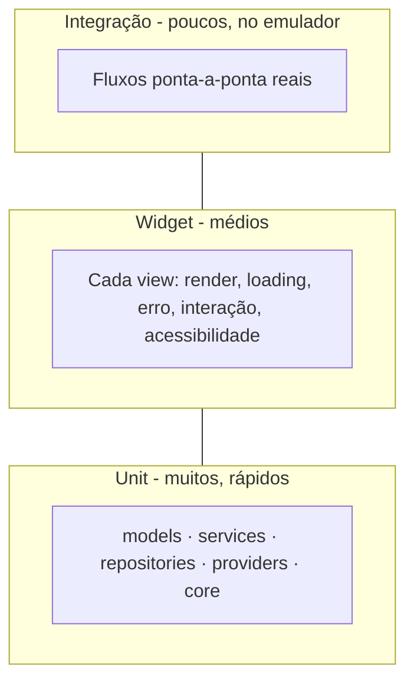

# Plano de Testes — DataAudio

**Projeto:** DataAudio — Catálogo Interativo de Músicas
**Versão do documento:** 1.1
**Status:** Em revisão
**Referências:** `01-PRD.md` (v1.1), `02-SDD.md` (v1.1), `adr/0009-testes-mocktail-injecao.md`, `adr/0013-golden-tests.md`, `adr/0014-fluxo-git-e-ci.md`

> **Changelog:** v1.1 — adicionados golden tests (validação visual), estratégia de branches e detalhamento do CI (o que roda local x esteira).

---

## 1. Objetivo

Garantir, por testes automatizados, que cada requisito funcional (RF01–RF10) e cada feature de personalização (PF01/PF02) se comporta conforme o critério de aceite do PRD, e sustentar a arquitetura contra regressões. **Meta de cobertura: ≥ 80% de linhas na camada de lógica** (models, services, repositories, providers, core).

## 2. Estratégia: a pirâmide de testes

Seguimos a pirâmide clássica — muitos testes rápidos na base, poucos e caros no topo:



Proporção-alvo aproximada: **~70% unit, ~25% widget, ~5% integração**. Golden tests são transversais ao nível de widget (validação visual, §4.3). A base larga é o que torna a meta de 80% viável sem depender de testes lentos de emulador.

## 3. Ferramentas

| Ferramenta | Uso |
|---|---|
| `flutter_test` | Base de unit e widget tests (vem com o Flutter). |
| `mocktail` | Mocks sem codegen (mock de `http.Client`, de repositórios, etc.). |
| `integration_test` | Testes ponta-a-ponta no emulador/device (pacote oficial). |
| `network_image_mock` | Evita chamadas reais de imagem em widget tests. |
| `matchesGoldenFile` (`flutter_test`) | Golden tests: comparação visual pixel a pixel. |
| `flutter test --coverage` + `lcov`/`genhtml` | Geração e relatório de cobertura. |

## 4. Níveis em detalhe

### 4.1 Unit (base)
Rápidos, sem I/O real. Cobrem:

- **Models:** `fromJson`/`toJson` (ida e volta), campos ausentes/nulos (ex.: `preview` vazio, capa ausente → lógica de placeholder), tipos inesperados.
- **Services:** `DeezerService` com `http.Client` **mockado** — parsing de sucesso, montagem correta de `index`/`limit`, e mapeamento de falhas (4xx/5xx/timeout/JSON malformado) para as exceções tipadas do ADR-0008.
- **Repositories:** implementações `Deezer*` com service falso; `Local*` com storage em memória — `add`/`remove`/`toggle`, ida-e-volta de serialização, persistência.
- **Providers:** com repositórios falsos — acumulação de páginas (`loadInitial`/`loadMore`), transições de `isLoading`, estado de erro; `FavoritesProvider.toggle`/`isFavorite`/notificação; `ListenedProvider`; `AuthProvider` (login/register/logout/sessão); `SettingsProvider` (tema/idioma + persistência).
- **Core:** `failure_mapper` (exceção → chave de mensagem).

### 4.2 Widget (meio)
Cada **view** montada com Providers de teste (repositórios falsos), verificando comportamento **e acessibilidade**:

| View | O que se testa |
|---|---|
| `CatalogView` | Renderiza `GridView`; mostra `CircularProgressIndicator` carregando; `ErrorView` em falha; "Carregar Mais" anexa itens; placeholder para capa ausente. |
| `TrackDetailView` | `FutureBuilder` nos estados loading/erro/sucesso; botão de favorito alterna; marcar como "Ouvida". |
| `FavoritesView` | Lista favoritos; desfavoritar remove reativamente. |
| `ListenedView` | Lista de ouvidas reflete o estado. |
| `LoginView` | Validação; login dispara navegação (mock); indicador de carregando. |
| Busca | Digitar termo + botão navega ao detalhe; termo sem resultado mostra mensagem. |
| `SettingsView` | Alternar tema muda `ThemeMode`; trocar idioma reflete nas strings. |

**Acessibilidade (RF10) tem matchers próprios do `flutter_test`** — usamos `meetsGuideline` com `textContrastGuideline` (contraste), `androidTapTargetGuideline` (tamanho de toque) e `labeledTapTargetGuideline` (rótulos), além de bombear a árvore com `textScaler` ampliado para provar que o layout não corta texto. Ou seja, RF10 é **testado**, não só inspecionado à mão.

### 4.3 Golden tests (validação visual)
Golden test é o "snapshot test" do Flutter: `matchesGoldenFile` renderiza o widget e compara **pixel a pixel** com uma imagem de referência versionada. As referências são geradas com `flutter test --update-goldens`; quando algo muda, o Flutter produz imagens de diff mostrando exatamente o quê.

Uso **cirúrgico** (evita a manutenção virar fardo) — para cada view principal (`Catalog`, `TrackDetail`, `Favorites`, `Listened`, `Login`, `Settings`):

| Combinação | O que protege |
|---|---|
| tema claro × tema escuro | PF01 — consistência e legibilidade nos dois temas |
| PT-BR × EN | PF02/RF10 — traduções mais longas estourando o layout |
| `textScaler` ampliado | RF10 — texto grande não corta o layout |

**Limites, declarados honestamente:** golden não julga se a interface "faz sentido" ou está bonita — só detecta que ela *mudou* em relação a uma referência que um humano aprovou. E é sensível a plataforma: fontes renderizam diferente entre SOs, então um golden gerado no Windows pode falhar num runner Linux. Por isso os goldens **rodam localmente** e ficam fora do CI (ver §9), salvo se fixarmos a plataforma de geração.

### 4.4 Integração (topo)
Com `integration_test`, no emulador/device (portanto, na máquina de vocês):

- **Fluxo principal:** login → catálogo carrega → abre detalhe → favorita → vai em Favoritos → vê o item → fecha/reabre o app → item persiste.
- **Fluxo de busca:** busca → detalhe do resultado.

Poucos, porém provam que as camadas conversam de verdade.

## 5. Rastreabilidade RF → teste

Cada critério de aceite do PRD (§5) vira ao menos um teste. Na prática TDD, **este é o teste que se escreve primeiro**.

| RF / PF | Nível principal | Verificação central |
|---|---|---|
| RF01 | unit + widget | paginação acumula; grid renderiza; placeholder |
| RF02 | widget | toque navega ao detalhe |
| RF03 | widget + unit | detalhe busca e exibe campos; `fetchTrack` |
| RF04 | unit + widget | `toggle` reflete globalmente |
| RF05 | widget | desfavoritar atualiza a lista |
| RF06 | unit | persistência sobrevive a "reinício" (novo storage) |
| RF07 | unit + widget | sem sessão não há catálogo; "Ouvida" persiste |
| RF08 | unit + widget | busca chama endpoint e navega |
| RF09 | widget + unit | loading aparece; erro vira mensagem amigável |
| RF10 | widget + golden | matchers de contraste, toque, rótulo, textScaler; golden com fonte ampliada |
| PF01 | unit + widget + golden | tema alterna e persiste; golden claro x escuro |
| PF02 | unit + widget + golden | idioma troca e persiste; golden PT x EN (layout não estoura) |

## 6. Cobertura: meta e o que fica de fora

**Meta:** ≥ 80% de linhas na lógica. Medição: `flutter test --coverage` gera `coverage/lcov.info`; usamos `lcov --remove` para excluir o que não faz sentido cobrir e então calculamos o percentual (ou geramos HTML com `genhtml`).

**Excluídos do cálculo** (glue/gerado, sem valor de teste):
- `lib/main.dart` e `lib/app.dart` (bootstrap/wiring).
- `lib/firebase_options.dart` (gerado pelo FlutterFire).
- Localizações geradas (`AppLocalizations`/`app_localizations*.dart`).
- Arquivos puramente de plataforma/DI triviais.

Exemplo de exclusão:
```
lcov --remove coverage/lcov.info \
  'lib/main.dart' 'lib/app.dart' \
  'lib/firebase_options.dart' 'lib/l10n/generated/*' \
  -o coverage/lcov.cleaned.info
genhtml coverage/lcov.cleaned.info -o coverage/html
```

> Nota honesta: 80% é meta de **linhas da lógica**, não do app inteiro. Telas têm ramos de UI difíceis/pouco úteis de cobrir; por isso a pirâmide concentra a cobertura onde ela protege de verdade (services/providers/repositories/models). A conferência final do número é na máquina de vocês — o ambiente de Chat não roda Flutter.

## 7. Convenções

- Estrutura de `test/` **espelha** `lib/` (ex.: `test/providers/favorites_provider_test.dart`).
- Arquivos terminam em `_test.dart`; padrão **Arrange-Act-Assert**; `group`/`test` descritivos.
- Imagens de referência dos goldens em `test/goldens/`, versionadas no repositório.
- Fakes e helpers em `test/fakes/` e `test/helpers/` (ex.: `FakeFavoritesRepository`, `InMemoryStorage`, `pumpApp()`).
- Nenhum teste toca rede ou disco reais: `http.Client` e storage sempre injetados/mockados (ADR-0009, ADR-0006).

## 8. Fluxo TDD (Test-Driven Development)

Como decidido, a implementação segue **red → green → refactor**, guiada pelos critérios de aceite:

1. **Red:** escrever o teste do critério de aceite (ex.: "loadMore anexa a próxima página") — ele falha.
2. **Green:** escrever o mínimo de código para passar.
3. **Refactor:** limpar mantendo o verde.

Ordem sugerida (de dentro para fora, respeitando as dependências): models → services → repositories → providers → views. Cada camada nasce testada antes da próxima depender dela. Isso também mantém a cobertura alta naturalmente, em vez de "testar no fim".

## 9. Fluxo de trabalho, branches e Integração Contínua

### 9.1 Estratégia de branches
**Trunk-based simplificado** (não Git Flow — ver `adr/0014`): `main` protegida + branches curtas de feature, nomeadas pelo requisito que entregam:

```
feature/rf01-catalogo    feature/rf04-favoritos    feature/rf08-busca ...
```

Nomear pelos RF dá rastreabilidade dupla: o avaliador vê no histórico **o que** foi feito e **por quem** — útil num grupo de até 4, onde cada integrante precisa comprovar sua contribuição (rubrica, item 7).

### 9.2 O que roda onde
Distinção importante: **os testes de integração não rodam no CI.** Eles exigem emulador/dispositivo real, o que em runner é lento, frágil e caro. Ficam como rede de segurança local, antes de abrir o PR.

| Ambiente | Executa | Quando |
|---|---|---|
| Máquina local | unit + widget + **integração** + **goldens** | Durante o TDD; passada de integração antes de abrir PR |
| CI (GitHub Actions) | `flutter analyze` + unit + widget + cobertura | Automático, a cada push e pull request |

### 9.3 O workflow de CI
Não existe CI "pronto" no GitHub — é um arquivo que **nós criamos** em `.github/workflows/ci.yml` durante o scaffolding:

```
dispara em: push, pull_request
├── setup Java + setup Flutter
├── flutter pub get
├── flutter analyze
└── flutter test --coverage   (unit + widget; sem integração, sem goldens)
```

Runner Linux, gratuito em repositório público. Opcionalmente com gate de cobertura mínima. Rodar integração no CI (via emulador Android em runner) é possível, mas fica **fora de escopo por ora** — se sobrar tempo, entra como job manual/agendado.

## 10. Onde cada teste roda

| Nível | Chat (sandbox) | Máquina local (Code) | CI (Actions) |
|---|---|---|---|
| Unit | ❌ (sem Flutter/pub) | ✅ `flutter test` | ✅ |
| Widget | ❌ | ✅ `flutter test` | ✅ |
| Golden | ❌ | ✅ `flutter test` / `--update-goldens` | ❌ (sensível a plataforma) |
| Integração | ❌ | ✅ `flutter test integration_test` (emulador) | ❌ (exige device) |
| Cobertura | ❌ | ✅ `flutter test --coverage` | ✅ |

Eu **escrevo** todos os testes; **vocês executam** e conferem os números. Essa é a mesma fronteira meu-lado/seu-lado de sempre.

---

### Fim da fase de documentação
Concluído o conjunto **PRD · SDD · ADRs · Plano de Testes**. Próximo movimento: **migrar para o Claude Code**, onde a primeira tarefa é verificar as dependências do ambiente (`flutter doctor` etc.) antes de qualquer código — e então iniciar o scaffolding e o ciclo TDD.
